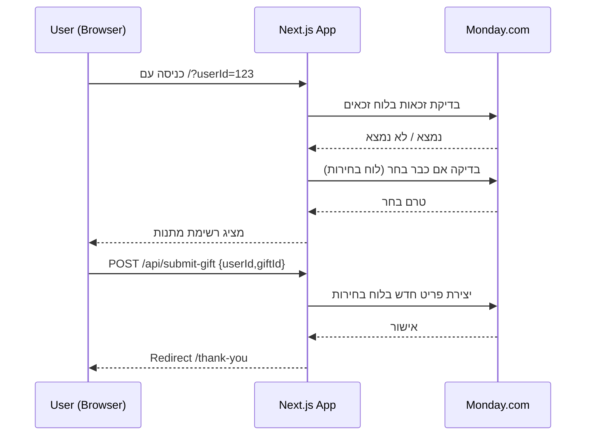

<div align="center">

# 🎁 אתר מתנות אגודת הסטודנטים – Ariel University

מיני־פורטל לבחירת מתנה אחת לסטודנטים שמילאו את הקריטריונים (למשל: תשלום דמי רווחה). בנוי על Next.js (App Router) ומתחבר ל‑Monday.com לשם אימות זכאות ושמירת בחירה חד־פעמית.

המערכת פשוטה, שקופה וקלה לפריסה.

</div>

## ✨ מה האתר עושה

1. סטודנט מקבל קישור עם פרמטר `userId` (לרוב מספר זהות).
2. האתר בודק (API `/api/check-gift`) האם הסטודנט קיים בלוח “זכאים” ב‑Monday.com ואם טרם בחר מתנה.
3. במידה והוא זכאי – מוצגת רשת המתנות.
4. הסטודנט בוחר מתנה ולוחץ שליחה.
5. הבחירה נרשמת כפריט חדש בלוח “בחירות המתנות” (Claims Board) עם שני עמודות: מזהה סטודנט + שם מתנה.
6. המשתמש מנותב לעמוד תודה.

כל סטודנט יכול לבחור מתנה פעם אחת בלבד (נבדק גם לפני וגם בזמן השליחה).

## 🧩 טכנולוגיות עיקריות

- Next.js 15 (App Router + Edge‑ready API Routes)
- React 19
- TypeScript
- TailwindCSS (v4) לעיצוב (קבצי utility + מחלקות מותאמות)
- אינטגרציה ל‑Monday.com דרך GraphQL API

## 📁 מבנה הפרויקט (תמצית)

```
src/
	app/
		api/
			check-gift/route.ts   # בדיקת זכאות + האם כבר בחר
			gifts/route.ts        # החזרת רשימת המתנות (כרגע סטטי)
			submit-gift/route.ts  # שמירת הבחירה בלוח היעודי
		page.tsx                # דף בחירת מתנה
		thank-you/              # דף תודה לאחר בחירה
	components/GiftGrid.tsx   # קומפוננטת הרשת והלוגיקה בצד לקוח
	lib/
		gifts.ts                # רשימת מתנות סטטית (ניתן להחליף במקור דינמי)
		monday.ts               # עטיפת קריאות ל‑Monday (GraphQL helpers)
		config.ts               # הפניות לנתיבי API + ENV
	types/monday.ts           # טיפוסים ל‑Monday (Items / Column Values ...)
```

## 🔐 משתני סביבה (ENV)

יש להגדיר (למשל בקובץ `.env.local` שאינו בקוד) את המשתנים הבאים:

| משתנה                                      | חובה                    | הסבר                                              |
| ------------------------------------------ | ----------------------- | ------------------------------------------------- |
| `MONDAY_API_KEY`                           | כן                      | טוקן API עם הרשאות קריאה/כתיבה ללוחות הרלוונטיים. |
| `MONDAY_USER_BOARD_ID`                     | כן                      | לוח Monday שמכיל את רשימת הסטודנטים הזכאים.       |
| `MONDAY_CLAIMS_BOARD_ID`                   | כן                      | לוח שבו נרשמות בחירות המתנה.                      |
| `MONDAY_USER_BOARD_USER_ID_COLUMN_ID`      | כן                      | מזהה עמודת ה‑UserId בלוח הזכאים.                  |
| `MONDAY_CLAIMS_BOARD_USER_ID_COLUMN_ID`    | כן                      | מזהה עמודת ה‑UserId בלוח הבחירות.                 |
| `MONDAY_CLAIMS_BOARD_GIFT_TITLE_COLUMN_ID` | לא (ברירת מחדל `text1`) | מזהה עמודת שם המתנה בלוח הבחירות.                 |

ברירת המחדל בעטיפת הקוד מניחה שאם לא הוגדרו עמודות מסוימות – יעשה שימוש בעמודות הטקסט הראשונות (`text`, `text1`).

## 🛣️ תזרים (Flow)



## 🧪 נקודות API

| מתודה | נתיב                         | תיאור                         | קלט                  | פלט (דוגמה)                               |
| ----- | ---------------------------- | ----------------------------- | -------------------- | ----------------------------------------- |
| GET   | `/api/check-gift?userId=123` | בדיקת זכאות ועדיין לא בחר     | userId בפרמטר שאילתה | `{ success: true }` או `{ error: "..." }` |
| GET   | `/api/gifts`                 | רשימת מתנות זמינה (סטטי כרגע) | —                    | `{ gifts: Gift[] }`                       |
| POST  | `/api/submit-gift`           | שמירת בחירת המתנה             | `{ userId, giftId }` | `{ success: true }` או `{ error: "..." }` |

טיפוס Gift (כיום סטטי):

```ts
type Gift = {
  id: string;
  title: string;
  description?: string;
  image?: string; // relative path under /public
  remaining?: number; // עתידי: ספירת מלאי
};
```

## 🚀 הרצה מקומית

1. התקנת תלויות:
   ```bash
   pnpm install
   ```
2. שכפול קובץ הסביבה לדוגמה והשלמת הערכים האמיתיים:
   ```bash
   copy .env.example .env.local   # Windows PowerShell / CMD
   # או בלינוקס / מק: cp .env.example .env.local
   ```
   לאחר מכן עריכה של `MONDAY_API_KEY` ושאר ה‑IDs.
3. הפעלה:
   ```bash
   pnpm dev
   ```
4. גלישה ל: http://localhost:3000/?userId=123456789 (להחליף במספר תקין שקיים בלוח).

## 🛡️ שיקולי אבטחה והוגנות

- אימות זכאות מתבצע בצד השרת בלבד (לא סומכים על הלקוח).
- קריאה ל‑Monday ללא cache כדי למנוע עקיפה דרך נתונים מיושנים.
- חסימת בחירה כפולה: בדיקה לפני שליחה וגם בשלב שמירת הפריט.
- אין החזרת מידע על סטודנטים אחרים – רק תשובת yes/no.

## 📦 אפשרויות הרחבה עתידיות

- חיבור לרשימת מלאי דינמית (עמודה עם כמויות בלוח אחר / DB).
- נעילת מתנה כאשר המלאי = 0.
- שליחת מייל אישור.
- תמיכה בשפות נוספות (i18n).
- דשבורד אדמין לצפייה בזמן אמת בבחירות.
- Rate limiting / חתימה דיגיטלית לפרמטר `userId` (JWT) כדי למנוע ניחוש.
- מעבר מ‑Monday ל‑PostgreSQL עבור שאילתות יעילות בקנה מידה גדול.

## 🧠 ארכיטקטורה – החלטות מרכזיות

- שימוש ברשימת מתנות סטטית (`gifts.ts`) כדי לפתח במהירות; ניתן להחליף למקור חיצוני בלי לשבור API.
- שימוש ב‑Monday כ־Single Source of Truth במקום DB ייעודי בשלב ראשון.
- קריאות GraphQL ממודולררות ב־`monday.ts` + טיפוסים ב־`types/monday.ts` מקלות על מעבר עתידי.
- שמירת קוד אימות פשוטה (pagination בלוחות גדולים באמצעות cursor).

## 🧪 בדיקות (כיוון אפשרי)

- הוספת Jest/Playwright לבדיקות E2E (בחירת מתנה → רישום בלוח מדומה).
- הזרקת שכבת mock ל‑Monday לצורך בדיקות יחידה.

## 🤝 תרומה

Pull Requests יתקבלו בברכה: שיפורי UX, נגישות, בינאום, בדיקות ועוד.  
פתח Issue לתיאום לפני שינוי גדול.

## ⚠️ אחריות

הקוד מסופק כפי שהוא (AS IS). ודא הגדרות אבטחה סביב טוקן ה‑Monday בשרת ההפעלה.

## 📄 רישיון

לא צוין רישיון מפורש. מומלץ להגדיר (MIT / Apache-2.0 וכו').

---

נבנה באהבה כדי לחסוך תורים וחלוקה ידנית. 🎉
למה הקוד חייב לקבל שינויים כרידמי כדי לדחוף שינויים לורסל?
תם ונשלם הקונדס
א
# atar-matanot

